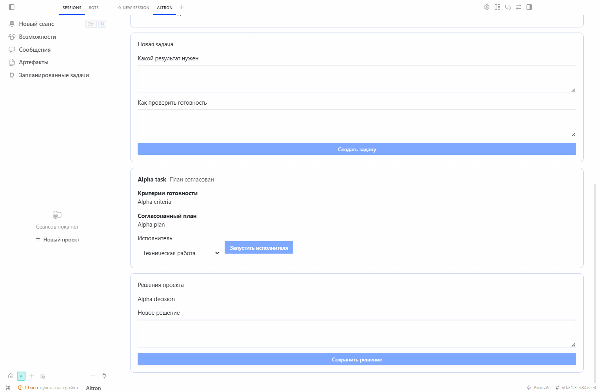

# Altron Desktop

English | [Русский](README.ru.md)

**Turn an idea into an approved AI task and checked files inside Hermes Desktop.**

Altron is an open-source Windows extension for people who want project work to remain traceable: requirements are saved, execution starts only after approval, and delivered files remain subject to explicit checks and user acceptance.

**[Download the beta kit](https://github.com/VibeSan7/altron-desktop/releases/download/v0.5.0-beta.2/altron-kit-0.5.0-beta.2.zip)** · [First-run guide](docs/FIRST_RUN.md) · [Ask a question or share feedback](https://github.com/VibeSan7/altron-desktop/discussions)

> Altron is not a standalone application. It requires the official Hermes Desktop, a configured model connection, and Windows for the currently tested beta.



<sub>Real Hermes Desktop interface with synthetic test data. No user project or credentials are shown.</sub>

## Why use it instead of a plain chat?

- Start with a need; Altron saves the follow-up interview and turns it into an explicit contract.
- Review scope, exclusions, deliverables, checks, folder and limits before any project run begins.
- Keep the project state outside one chat response and inspect the actual files and command receipts.
- Request a revision without losing the original task, feedback or attempt history.
- Accept the result yourself: an AI response saying “done” is not treated as completion.

**Workflow:** idea → interview → approved contract → work and checks → files for your review.

Public beta **0.5.0-beta.2** adds this **interview → work → result** flow. The published archive completed an explicitly authorized autonomous run with a real model on Windows; see the [verification report](docs/DESKTOP_VERIFICATION.md#real-desktop-authorized-real-model-run) and [sanitized evidence summary](docs/evidence/live-model-0.5.0-beta.2.json). This single run confirms the tested path, not general model quality. The current interface is in Russian; only the README has a separate Russian translation. Other documentation, issue templates and release notes are in English.

## Download and open — no commands required

For a guided first run, use the complete `altron-kit-0.5.0-beta.2.zip`: extract this outer ZIP to read the included [first-run guide](docs/FIRST_RUN.md). Do not extract the inner profile `.tar.gz` files. The kit contains both profile archives, checksums, the English and Russian README, and the usage/update/verification guides. It is not the GitHub Source code ZIP.

1. Install the [official Hermes Desktop](https://hermes-agent.nousresearch.com/docs/user-guide/desktop).
2. For this public beta, download the supplied **`altron-0.5.0-beta.2.tar.gz`** and matching `SHA256SUMS.txt` from the release, or build the archives from this branch. The public 0.4 archive does not include autonomy. Do not extract the archive or choose GitHub's Source code ZIP.
3. In Desktop, use **Import profile** next to the add-profile button and select the archive. This creates a separate `altron` profile, does not replace `default`, and refuses to overwrite an existing profile.
4. Fully close and reopen Desktop. Enable **Desktop: Altron** in the plugins section, then select **`altron`** in the profile rail. The package configuration already enables the Python component for that profile.
5. Click **Altron** in Desktop's bottom bar to open its workspace tab. On subsequent starts, select the `altron` profile first as well: this package's backend is not enabled in `default`.
6. Connect your own model using Hermes's built-in settings. In Altron, select the configured connection and a model from the catalog, or use the action that copies the current Hermes connection. Do not enter keys or passwords in Altron fields.

The current Altron interface is in Russian. This documentation describes its actions in English.

Desktop must provide the `host.openWorkspace`, `ctx.rest`, and `host.onEvent` SDK capabilities. Tested build: **Hermes Desktop 0.17.3 with Hermes Agent 0.21.3**, source commit `d84ece48b8552501660be229797e2d2aa4cee8db`; Python 3.11+. Recovery also requires Hermes's runtime registry and cross-process session-ownership checks. If these capabilities are unavailable, Altron keeps the operation blocked rather than assuming execution has stopped.

Details: [installation, usage, and rollback](docs/ALTRON_DESKTOP.md).

## Autonomous projects

- Start with a need, not a technical specification. Follow-up questions and the proposal are saved.
- Approve the goal, exclusions, deliverables, checks, folder and limits once.
- Let the backend continue and repair failed checks across bounded turns, without an open Altron tab.
- Inspect actual files, native command-check receipts and usage instructions. Automatic readiness is not user acceptance.
- Request a confirmed stop, reconcile uncertain execution safely, or explicitly authorize a revision.

Keep Hermes Desktop running. This is not a Windows background service; a full shutdown requires recovery. Work/time limits are not spending caps. The beta does not prove week-long unattended reliability or universal reasoning quality. [Full autonomous-project guide](docs/AUTONOMOUS_PROJECTS.md).

## Manual mode remains available

- Create multiple projects with separate folders, tasks, and decisions.
- Ask Altron to propose a plan or write one yourself.
- Approve a plan **before** starting an executor.
- Choose technical work, research/business work, or documentation.
- Save each role's model, connection, and selected instructions.
- Approve a sequence of specialists: the next receives verified files from the previous step and starts only after confirmed completion.
- Pause a team without hidden retries or model substitutions.
- Cancel a plan that has not started and check the actual state after a failure.
- Request revisions within the same task ID, retaining feedback and attempt history and requiring new explicit approval.
- Choose or create a folder and fill a learning example without starting it automatically.
- Search tasks, move settled tasks into a reversible archive, and see the next required actions.
- Set the number of permitted new runs and view usage data only when Hermes provides it.
- Generate a diagnostic report without conversations, user paths, or secrets.
- Deliver results as real files, check their integrity with SHA-256, and accept the work manually.
- Request a separate review through a separately confirmed run.
- Open the executor's conversation in Hermes and request a stop.
- Return to projects after restarting without automatically resubmitting tasks.
- Verify an update package against its published checksum, create a backup, and restore compatible previous code without replacing current projects or settings. Format-1 code cannot be restored over a migrated format-2 database.

**Example:** a project called “Website,” a task to prepare a contact page, and acceptance criteria requiring the page to open and display a phone number and address. First approve the plan, then start the executor. Its file and report are submitted for review; the model saying “done” does not complete the task by itself.

## Safety and honest status reporting

Altron keeps its own database at `altron/altron.db` inside the selected Hermes profile. The package contains no author projects, message history, tokens, passwords, or default models.

- Project folders cannot overlap; access to another project's task is rejected.
- The `altron_context` and `altron_update` tools are bound to the assigned session.
- Clicking twice does not start a second executor.
- Acknowledgment that a task was delivered is not treated as completion.
- A terminal Hermes error is stored as an error rather than leaving the task running forever.
- After acknowledgment is lost or Desktop restarts, unfinished execution is treated as unconfirmed. There is no automatic resubmission.
- Only the user can accept a result; a changed or unavailable file blocks acceptance.

**This is application-level data separation, not a separate virtual machine.** Ordinary Hermes tools retain their permissions. Dangerous actions remain subject to Hermes's built-in restrictions and confirmations; Altron does not disable them.

## What has been tested — and what is not claimed

The [verification report](docs/DESKTOP_VERIFICATION.md) distinguishes:
- tests of data, the HTTP API, tool context, and execution control;
- real Desktop runs with synthetic projects, restarts, and rejection of an invalid connection;
- archive construction, contents, and native import without overwriting profiles;
- automated GitHub checks.

The previously published 0.3 also passed a real task using `openai-codex / gpt-6-astra`: the model created a file and submitted it to Altron, and programmatic checks verified its contents and SHA-256 before acceptance. See the [report](docs/DESKTOP_VERIFICATION.md) for details and exact limits. This tested the owner's existing connection, not a new account's first login or every provider. Users connect their own accounts and manage availability in Hermes. Teams follow an approved plan rather than running unattended in the background. The beta does not include its own Telegram bridge, automatic migration from the old Registry, a standalone Hermes installer, or distributed infrastructure. Selected agency-agents instructions are adapted to Altron's rules; source and license details are in [THIRD_PARTY_NOTICES.md](THIRD_PARTY_NOTICES.md). A specialist instruction is not a separate tool and does not guarantee response quality.

Built-in maintenance is available from 0.3 onward. To upgrade from 0.2, or cancel an unstarted plan that blocks an upgrade from 0.3, use the separate `altron-maintenance-0.5.0-beta.2.tar.gz` archive and the [step-by-step upgrade and rollback guide](docs/UPDATING.md). Do not import the main archive over an existing profile. Installing Hermes on a clean computer and signing into a new account remain outside the verified scenario.

## Development

Node.js 22 and Python 3.11+. Ordinary tests do not require a working Hermes profile.

```sh
npm ci
```

```sh
npm test
```

```sh
npm run build
```

```sh
python -m pip install -r altron/requirements-test.txt
```

```sh
python -m pytest -c altron/pytest.ini altron/tests --ignore=altron/tests/test_plugin.py --ignore=altron/tests/test_native_loader.py --ignore=altron/tests/test_profile_import.py --ignore=altron/tests/test_bundle.py
```

The profile is built by the standard Python step in the [workflow](.github/workflows/altron-desktop.yml); its contents are defined by [manifest.json](packaging/manifest.json). Run `test_bundle.py` after building the archive.

Integration checks require an installed Hermes. `npm run test:native` also uses `ALTRON_JS_HOME` (the `apps/desktop` directory) and `ALTRON_PYTHON` (its Python interpreter). The test creates its own settings and does not inherit an environment containing keys. The separate [real-model test](docs/LIVE_TESTING.md) requires the explicit `ALTRON_LIVE=1 npm run test:live` opt-in; without it, the test is skipped.

## Repository structure

- `altron/` — the Desktop module, API, tools, UI source, and tests.
- `packaging/` — a neutral profile and an explicit package file list.
- `docs/` — guides, verification boundaries, and the maintenance contract.
- `.github/workflows/` — automated tests and reproducible builds.

## Feedback

Use [GitHub Discussions](https://github.com/VibeSan7/altron-desktop/discussions) for questions, first-run feedback and examples of useful results. Report reproducible problems through [GitHub Issues](https://github.com/VibeSan7/altron-desktop/issues). Include Windows, Hermes, and Altron versions, reproduction steps, and expected versus actual behavior. A GitHub account is required to post, but not to download. **Do not attach** keys, `.env`, `auth.json`, an entire profile directory, private conversations or raw logs. Check screenshots for personal data before publishing them.

[MIT](LICENSE). Hermes and its dependencies have their own terms and are not copied into the Altron archive.
